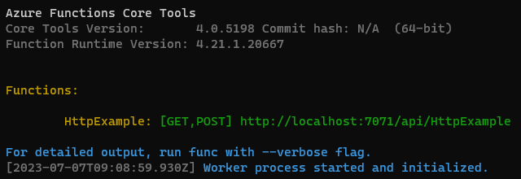
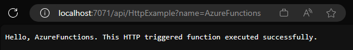

# Challenge 1

## Create your first Azure Function (PowerShell)

1. Run the ```func init``` command, as follows, to create a functions project in a folder named LocalFunctionProj with the specified runtime:

    ```powershell
    func init LocalFunctionProj --worker-runtime powershell
    ```

1. Navigate into the project folder:

    ```powershell
    cd LocalFunctionProj
    ```

1. Add a function to your project by using the following command, where the ```--name``` argument is the unique name of your function (HttpExample) and the ```--template``` argument specifies the function's trigger (HTTP).

    ```powershell
    func new --name HttpExample --template "HTTP trigger"
    ```

## Examine the file contents

1. Navigate to the ```LocalFunctionProj``` folder and open the ```HttpExample``` folder. You should see the following files:

    - ```function.json```: This file describes the function bindings, triggers, and other configuration settings.
    - ```run.ps1```: This is the main function script.

## Run the function locally

1. Run the function locally by using the following command:

    ```powershell
    func start
    ```

    You should see an output similar to the following:

    

## Test the function

1. Open a browser with the URL [http://localhost:7071/api/HttpExample?name=AzureFunctions](http://localhost:7071/api/HttpExample?name=AzureFunctions) or a new PowerShell window and run the following command to test the function:

    ```powershell
    Invoke-WebRequest -Uri http://localhost:7071/api/HttpExample?name=AzureFunctions
    ```

    You should see an output similar to the following:

    