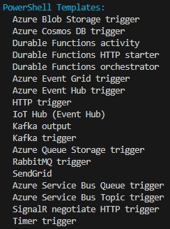
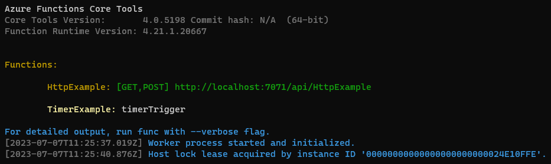

# Challenge 2

## Create a timer triggered Azure Function (PowerShell)

### Add a timer triggered function to your project

1. Make sure you have [started Azurite](https://learn.microsoft.com/azure/storage/common/storage-use-azurite?tabs=visual-studio#run-azurite) emulator. 
1. List availavle templates by running the following command:

    ```powershell
    func templates list --language powershell
    ```

    You should see an output similar to the following:

    

1. Add a timer triggered function to your project by using the following command, where the ```--name``` argument is the unique name of your function (TimerExample) and the ```--template``` argument specifies the function's trigger (TimerTrigger).

    ```powershell
    func new --name TimerExample --template "Timer trigger"
    ```

### Examine the file contents

1. Navigate to the ```TimerExample```-folder and open the ```function.json```-file. You should see the following content:

    ```json
    {
        "bindings": [
            {
                "name": "Timer",
                "type": "timerTrigger",
                "direction": "in",
                "schedule": "0 */5 * * * *"
            }
        ]
    }
    ```

    The ```schedule```-property defines the schedule for the timer trigger. The schedule is a cron expression that defines when the function should run. The cron expression in the example above defines that the function should run every 5 minutes.

### Run the function locally

1. Navigate to the root folder of your Function App
1. Run the function locally by using the following command:

    ```powershell
    func start
    ```

    You should see an output similar to the following:

    

    After a while (depending on the schedule) you should see an output similar to the following:

    ```powershell
    [2023-07-07T11:30:00.690Z] INFORMATION: PowerShell timer trigger function ran! TIME: 07/07/2023 11:30:00
    ```

If you get the error message "The listener for function 'Functions.TimerExample' was unable to start.", verify that the [Azurite emulator is properly started](https://learn.microsoft.com/azure/storage/common/storage-use-azurite?tabs=visual-studio#run-azurite).